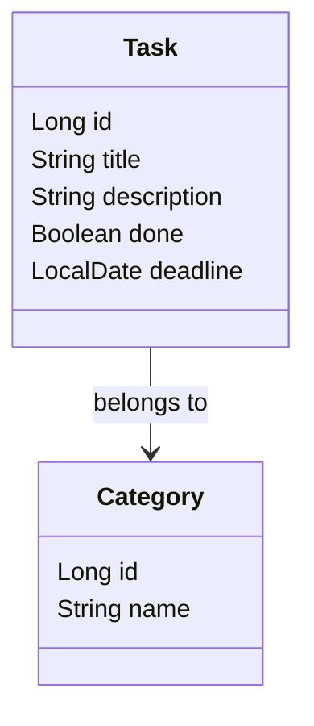

# Desafio Publicando Sua API REST na Nuvem 

Construindo uma API Restful própria utilizando Spring Boot e Java 17

## Diagrama de classes 

```mermaid

classDiagram
    class Task {
        Long id
        String title
        String description
        Boolean done
        LocalDate deadline
    }

    class Category {
        Long id
        String name
    }

    Task --> Category : belongs to
```
